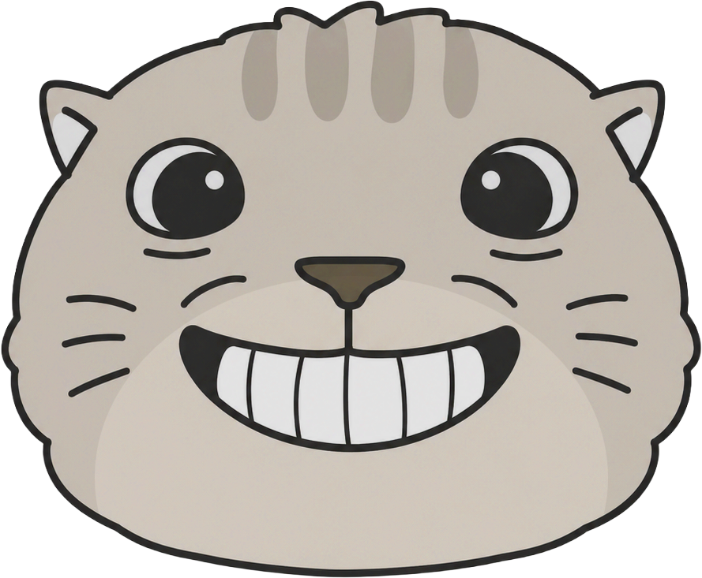



# ShuShuscanner

ShuShuscanner is an unofficial personal fork of [RatScanner/RatScanner][upstream-ratscanner], an external item scanner for [Escape from Tarkov][escape-from-tarkov].

This fork focuses on Chinese localization, UI adjustments, custom branding, and personal branch maintenance.

It is not affiliated with, endorsed by, or maintained by the original RatScanner authors. Original copyright and license notices are preserved according to the project license.

 

## Disclaimer

ShuShuscanner is an external screenshot-based tool. It does not read or modify game memory.

Battlestate Games is not affiliated with this project. Use this fork at your own discretion.

 

## What Changed in This Fork

- Renamed the application to ShuShuscanner
- Chinese UI localization, with Chinese name “鼠鼠小账本”
- Updated logo and application icon
- Adjusted settings layout and scan status display
- Added separate configurable scan hotkeys
- Improved PvE data refresh behavior
- Added a general setting for status information display, disabled by default
- Default language options now start in English
- Debug logging and debug screenshots are disabled by default
- Refreshed item data when a scanned item id is missing from the local cache
- Relaxed name-scan marker detection for current game UI scaling
- Fixed a crash when typing in the M+N interactable overlay search field

 

## What it does

ShuShuscanner allows you to scan items in the game and provides you with data about items (average price, value per slot, ...).

The information is taken from a [third-party API][tarkov-dev] which takes the data directly from the game.

 

## How it works

The tool is entirely external. This means it is not accessing any memory of the game, like cheats do.

Instead, when you want to scan a item, a screenshot is taken and image processing is applied to identify the clicked item. The item is then looked up in the database and information is displayed in the window and with a overlayed tooltip.

 

## How to use

Your game may need to be in either `Borderless` or `Windowed` mode for the overlay to work.

There are currently two types of item scan methods

### Name scanning

_Name scanning refers to scanning the inspection name of a item._

- Simply left click onto the magnifier icon inside the inspect window

Limitations

- Uses / durability is always assumed at 100%
- Weapons and other modable items will only show info of the base item

### Icon scanning

_Icon scanning refers to scanning the icon of a item._

- Hold the modifier key down while left clicking on a item
- The modifier key can be changed in the settings (default is `Shift`)

Limitations

- It is unfortunately no longer possible to scan weapons
- Uses / durability is always assumed at 100%
- Items which share a icon with other items (especially keys) will result in a uncertain match
- There will be missmatches when scanning icons in the top left of the item stash since the bright light (top center of the screen) interferes with it

 

## Minimal UI

Switch to the minimal ui by clicking the dedicated button inside the titlebar.
Get back to the standard view by **double clicking** anywhere inside the window.

Background opacity as well as the data which is shown can be configured in the settings.

## Setting up the repository for development

1. Clone the repository
2. Copy the `Data` folder from the latest release to `ShuShuscanner\Data\`

The application version is currently `1.0.4`.

### Compiling

- Open the solution inside Visual Studio and click Build -> Build Solution

### Publishing

- Run the `publish.bat` script which is inside the repository root.
- The output will be located in a folder called `publish` on the same level as the publish script.

 

## Contributing

Please read `CONTRIBUTING.md` before contributing.

 

## License and Attribution

This project is based on [RatScanner/RatScanner][upstream-ratscanner].

Original copyright and license notices are preserved. This fork remains subject to the original repository license.

[escape-from-tarkov]: https://www.escapefromtarkov.com/
[tarkov-dev]: https://tarkov.dev/
[eft-icons-repo]: https://github.com/ShuShuscanner/EfTIcons
[faq-page]: FAQ.md
[faq-page-can-i-get-banned]: FAQ.md#can-i-get-banned-for-using-rat-scanner
[upstream-ratscanner]: https://github.com/RatScanner/RatScanner
